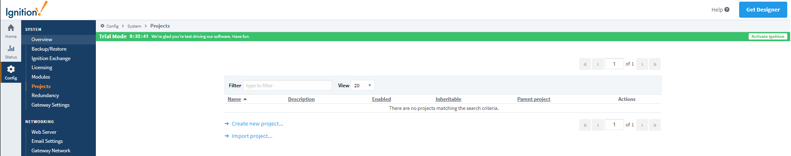

SiteSync's UI runs on Ignition's Perspective, which allows for reactive screens and the use of mobile applications.

Instructions here to install SiteSync LoRaWAN module's UI

1. From the Ignition Gateway GUI, navigate to `Config > Projects` using the navigation menu on the left

2. Select `Import project..` and on the next page upload the `.zip` file containing the SiteSync perspective project
3. Once uploaded, you will see the SiteSync project added to your list of installed projects

To launch the SiteSync Perspective project, navigate to the Home tab in the navigation menu, and scroll to find the 
`View Projects` button. From here, you will be able to launch the SiteSync Perspective project.