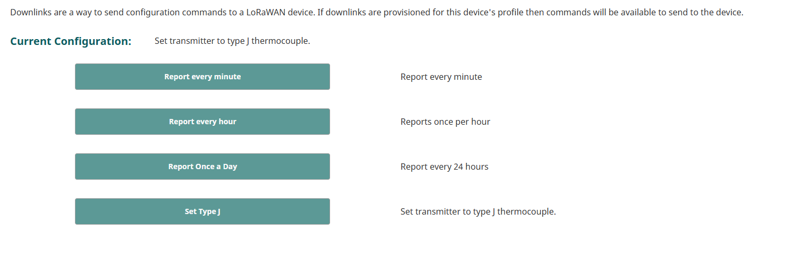

LoRaWAN devices can accept configuration changes and commands through Downlinks, a binary command sent through the LoRa Networkserver that the device has an active session wiht.

SiteSync give the ability to maintain and manage a library of pre-loaded commands, unique to the sensor. 

If the sensor you have synced has defined downlinks, you will be able to access them on the Device page. 
  

On button click, the command is sent, and the description of the last downlink will be assigned to the device for visibility.

If your sensor does not have defined downlinks, you can add one under Device Profiles/Downlink.

The following is needed to create a downlink:

|  Field                     | Description                               |
|-------------------------------|-------------------------------------------|
| Name             | Friendly name of the device                  |
| Hex Command              | the binary command to be sent, in hex        |
| Port             | Port to send command on, if no port specified by manufacturer then use 2                     |
| Description | The description of the downlink, will be stored on the device after downlink is sent. |

SiteSync does not take any responsibility for custom downlinks.

