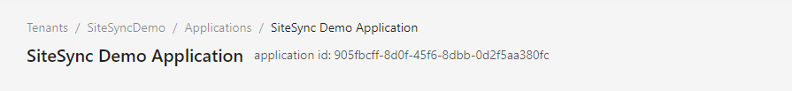
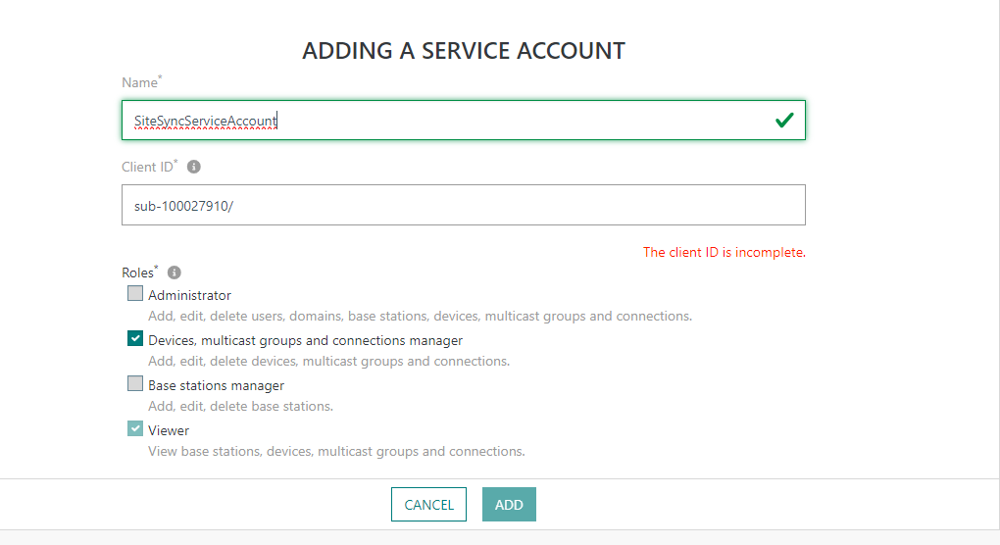
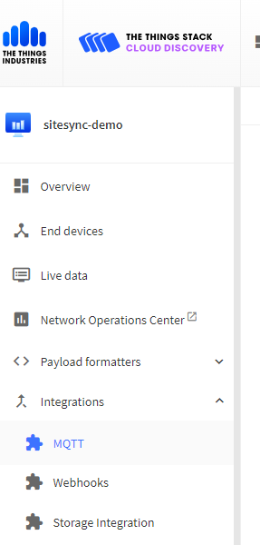
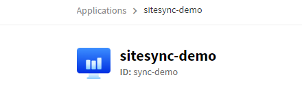
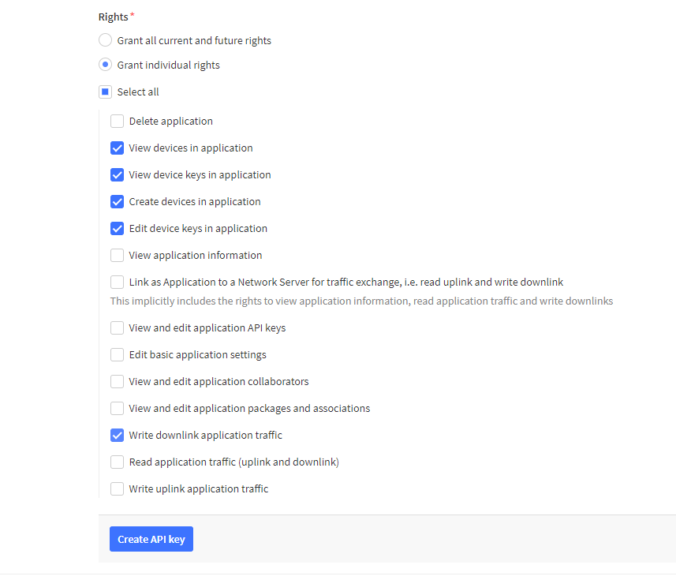
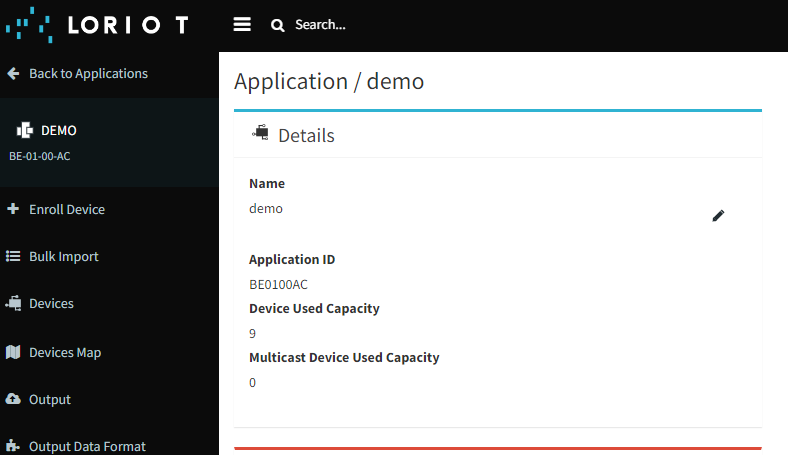

---
hide:
  - toc
---

=== "Chirpstack"

    Chirpstack is an open sourced LoRaWAN network server, that can be easily set up. The below is based on the default Chirpstack settings, check with whoever set up your Chirpstack to confirm how it is configured.

    ## MQTT 
     Chirpstack has a built in broker for sharing data, SiteSync will connect to this integration.

    The MQTT integration will have the following fields to copy into SiteSync to create the MQTT connection.

    | SiteSync Field                | Description                                                                                   |
    |-----------------------------|-----------------------------------------------------------------------------------------------|
    | Broker URL or IP Address    | the URL that you access your instance of Chirpstack at, without http://                                            |
    | Port                        | 1883                                    |
    | MQTT Topic                  | application/{chirpstack-application-id}/device/+/event/up                                         |
    
    *On the MQTT Topic, replace {chirpstack-application-id} with the chirpstack application ID that your synced devices are in*

    Default is no MQTT username or password or authentication required, but SiteSync recommends setting authentication to secure the data on your broker.

    ## Join Server

    The following fields are needed to create an API connection to your network server:
    
    | SiteSync Field                | Description                                                                                   |
    |-----------------------------|-----------------------------------------------------------------------------------------------|
    | URL     | The URL of the instance of your TTN, how you access it, plus the port 8090                                            |
    | Application ID                       | The ID of the application you wish to sync devices into.                                    |
    | Device Profile ID                    | The default device profile that will be used, can be created under Device Profiles.                                     |
    | API Token                 | token generated by Chirpstack, generated under API Keys                                            |

    ### Where to find these fields in Chirpstack

    **Application ID**

    This is listed on the main page of your application:
    

    **Device Profile ID**

    This is listed on the main page of your device profile:
    

    We reccomend making a generic device profile to start, and customizing as your needs grow.

    **API Token**

    API Tokens are generated under the API Keys menu in Chirpstack.

=== "ThingPark"

     ThingPark is an enterprise grade LoRaWAN network server by Actility, they offer a community edition (TPC), an enterprise edition (TPE), and a self hosted on-prem version. The below guide is based on the community edition, but behaviors should be consistent across the offerings.

    ## MQTT 
    Actility ThingPark outputs its' data to an external MQTT broker, so the below are settings to also subscribe to the same broker.

    The MQTT integration will have the following fields to copy into SiteSync to create the MQTT connection.

    | SiteSync Field                | Description                                                                                   |
    |-----------------------------|-----------------------------------------------------------------------------------------------|
    | Broker URL or IP Address    | Broker URL or IP Address: your external broker address |
    | Port                        | your external broker port, usually 1883 or 8883 (TLS)                                    |
    | MQTT Topic                  | mqtt/things/+/uplink                                       |
    
    *MQTT Topic is editable in ThingPark, above is the default*

    ## Join Server

    The following fields are needed to create an API connection to your network server:
    
    | SiteSync Field                | Description                                                                                   |
    |-----------------------------|-----------------------------------------------------------------------------------------------|
    | URL     | the URL that you access your instance of ThingPark, the community url is https://community.thingpark.io/                                      |
    | Application ID                       | The ID of the application you wish to sync devices into.                                    |
    | UserName                   | The username of the service account to use with SiteSync                                     |
    | Password                | corresponding service account password                                        |

    ### Where to find these fields in ThingPark

    **Application ID**

    This is listed on the main page of your Connection:

    #connection id picture

    Use the full string of the ConnectionID where you want to sync devices into.

    **Service Account**

    This can be generated under the Administration menu, select Service Accounts. Add a service account and give it the following permissions:

    | Permission  ||
    |-------------||
    | Devices multicast groups, and connections manager| |

    
    

=== "The Things Network"

    The Things Network (TTN) or The Things Stack (TTS) or The Things Industries (TTI) is an open sourced LoRaWAN network server, that can be accessed through public cloud, or hosted privately.
    The below guide is based on the community edition, and should be the same, however, it can be privately configured and hosted, so if not using the publicly hosted version, check how your instance is configured. 

    ## MQTT 
    TTN has an MQTT integration to export processed data, SiteSync will connect to this integration.

    To set up an MQTT output from TTN, select your application, navigate to Integrations, and select MQTT. 
    
    

    The MQTT integration will have the following fields to copy into SiteSync to create the MQTT connection.

    | SiteSync Field                | Description                                                                                   |
    |-----------------------------|-----------------------------------------------------------------------------------------------|
    | Broker URL or IP Address    | copy the Public address under MQTT Server host, without port number                                                |
    | Port                        | MQTT Server host port number, either 1883 or 8883 for TLS                                     |
    | MQTT Topic                  | v3/{username}/devices/+/up                                                  |
    
    *On the MQTT Topic, replace {username} with the MQTT username*

    MQTT Authentication is required and is ACL bound, fill in username and generated password.

    ## Join Server

    The following fields are needed to create an API connection to your network server:
    
    | SiteSync Field                | Description                                                                                   |
    |-----------------------------|-----------------------------------------------------------------------------------------------|
    | URL     | The URL of the instance of your TTN, how you access it.                                            |
    | Application ID                       | The ID of the application you wish to sync devices into.                                    |
    | API Token                 | token generated by TTN, limited to the specific app                                             |

    ### Where to find these fields in TTN

    **Application ID**

    This is listed on the main page of your application:
    

    **API Token**

    On your selected application, create an API key with the following permissions:
  
  

    | Permission  |
    |-------------------------------|
    | View devices                  | 
    | View device keys              |
    | Create Devices                |
    | Edit device keys              | 
    | Write downlink application traffic | 

       

=== "Multitech Conduit"
    The Multitech Conduit 300 and mPower models are LoRaWAN gateways that can host their own onboard network server at the edge. The following guide is how to integrate with SiteSync.

    ## MQTT 
    The MultiTech Conduit outputs its data to an external MQTT broker, so the below are settings to also subscribe to the same broker.

    The MQTT integration will have the following fields to copy into SiteSync to create the MQTT connection.

    | SiteSync Field                | Description                                                                                   |
    |-----------------------------|-----------------------------------------------------------------------------------------------|
    | Broker URL or IP Address    | Broker URL or IP Address: your external broker address |
    | Port                        | your external broker port, usually 1883 or 8883 (TLS)                                    |
    | MQTT Topic                  | user defined                                      |

    ## Join Server

    The following fields are needed to create an API connection to the Conduit:
    
    | SiteSync Field                | Description                                                                                   |
    |-----------------------------|-----------------------------------------------------------------------------------------------|
    | URL     | the URL where you can access the Conduit, https is recommended                                  |
    | Username                       | a Username onboard the Multitech Conduit, SiteSync recommends creating a service account, separate from the management login                                   |
    | Password                 | the corresponding password                               |

    Note, SiteSync default adds devices to the onboard application 01-01-01-01-01-01-01-01, and we recommend setting your output broker ID to the same. For help getting your data out of the Conduit, reach out to Multitech Support, or SiteSync support.

=== "Loriot"
    LORIOT is a network server service provider LORAWAN of Swiss origin.  LORIOT offers a hosted and on-premise LORAWAN Network Server. The below guide is based on the USPRO edition, but behaviors should be consistent across the offerings.

    ## MQTT 
    LORIOT outputs its' data to an external MQTT broker, so the below are settings to also subscribe to the same broker.

    The MQTT integration will have the following fields to copy into SiteSync to create the MQTT connection.

    | SiteSync Field                | Description                                                                                   |
    |-----------------------------|-----------------------------------------------------------------------------------------------|
    | Broker URL or IP Address    | Broker URL or IP Address: your external broker address |
    | Port                        | your external broker port, usually 1883 or 8883 (TLS)                                    |
    | MQTT Topic                  | user defined                                      |
    

    ## Join Server

    The following fields are needed to create an API connection to your network server:
    
    | SiteSync Field                | Description                                                                                   |
    |-----------------------------|-----------------------------------------------------------------------------------------------|
    | URL     | the URL that you access your instance of Loriot                                     |
    | Application ID                       | The ID of the application you wish to sync devices into.                                    |
    | API Token                   | Token generated by LORIOT to authenticate API calls                                     |

    ### Where to find these fields in LORIOT

    **Application ID**

    This is listed on the main page of your Application

      

    **API Token**

    This can be generated Account/API Keys.

         | 

