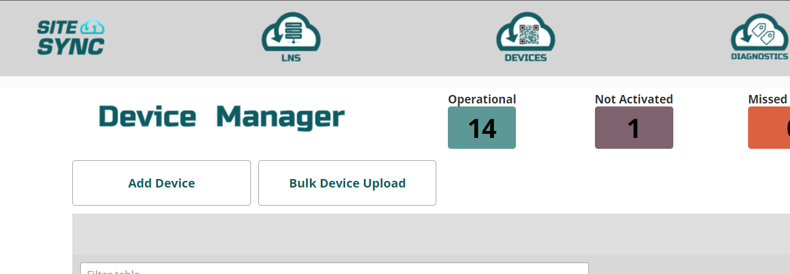
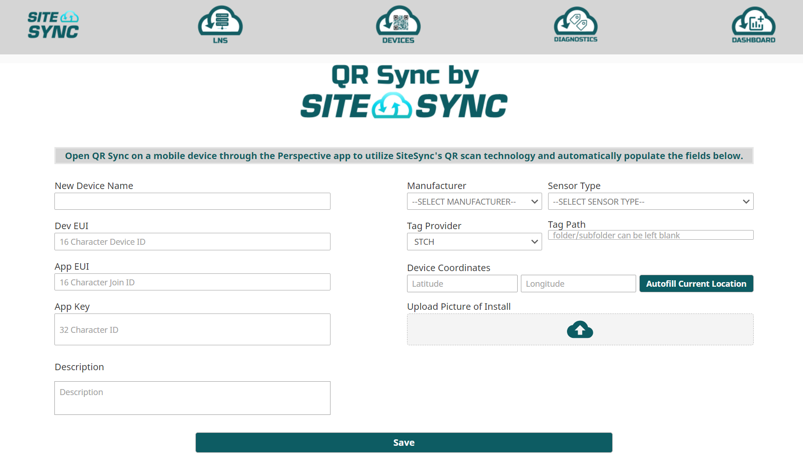
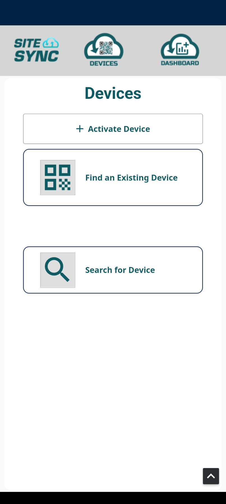
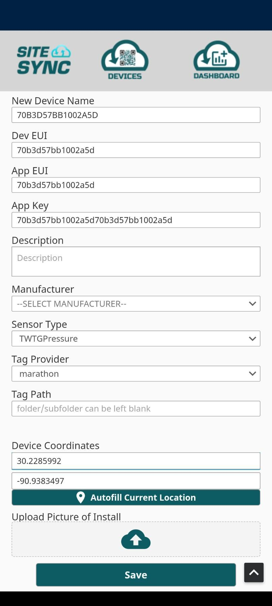

QR Sync is a SiteSync feature that provides users with instant provisioning of sensors by scanning a QR code. Embedded
into the QR code are all required join keys for a sensor (devEUI, appKey, joinEui) and when scanned are created into
Ignition tags.

This can be done through a form on the website or through the Perspective mobile app allows users to utilize their mobile device's camera to quickly scan onboard QR codes. 

**Web**

To add a device on the web version, navigate to Devices and click on "Add Device"

The following fields are required:
-devEUI
-appEUI (sometimes called JoinEUI)
-appKey
-Sensor Type
-Name

When the above are filled out, hit "Save" and the device will be created in SiteSync and added to your network.

**Mobile**

To onboard a device with the app, connect to the SiteSync perspective project, and navigate to Devices.

Select "Activate Device" and launch the QR scanner.

SiteSync currently supports the following formats:

-The LoRa Alliance QR code format 

-QR Codes provided by SiteSync

If neither of these formats are detected, the app will return everything it reads to the user to parse further.

Once the information is filled in, hit submit and the device will be created in SiteSync and added to your network.
